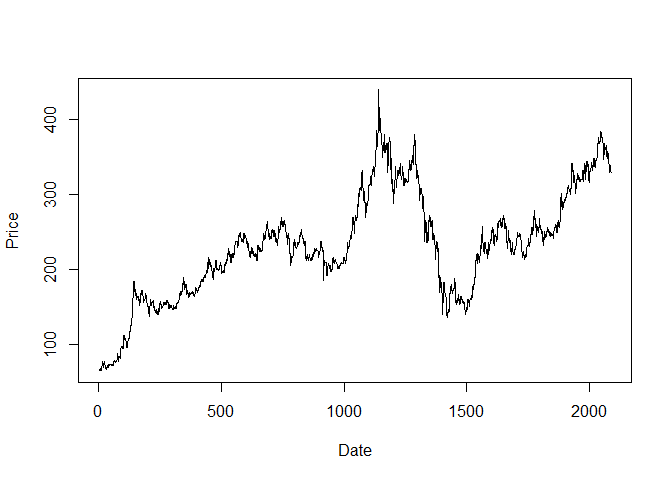
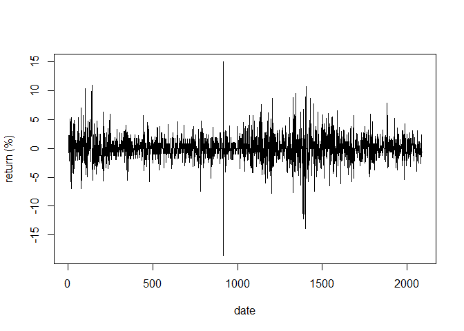
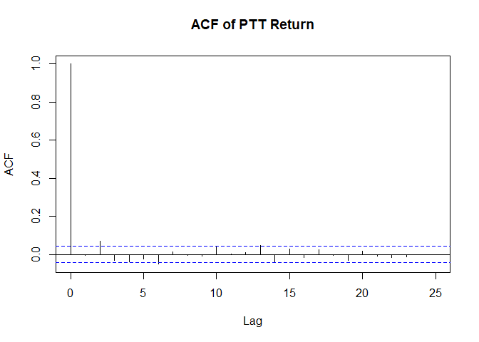
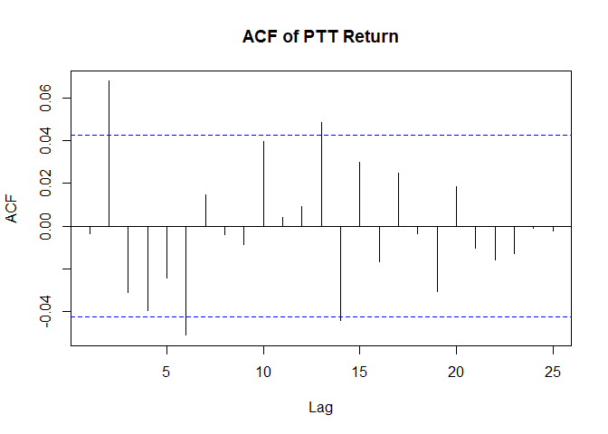

EC435: ตัวอย่างจากบทที่ 1
================
เฉลิมพงษ์ คงเจริญ

นำเข้าข้อมูลและสร้างกราฟ
------------------------

``` r
ptt <-read.csv("https://raw.githubusercontent.com/chaleampong/EC435/master/pttstock.csv",
               header = TRUE, stringsAsFactors = FALSE)
head(ptt)
```

    ##        date price
    ## 1 6/17/2003  65.5
    ## 2 6/18/2003  66.0
    ## 3 6/19/2003  67.0
    ## 4 6/20/2003  66.5
    ## 5 6/23/2003  68.0
    ## 6 6/24/2003  66.5

``` r
str(ptt)
```

    ## 'data.frame':    2089 obs. of  2 variables:
    ##  $ date : chr  "6/17/2003" "6/18/2003" "6/19/2003" "6/20/2003" ...
    ##  $ price: num  65.5 66 67 66.5 68 66.5 66 67.5 66 66.5 ...

``` r
plot.ts(ptt$price, xlab = "Date", ylab ="Price")
```



การสร้างตัวแปรผลได้ตอบแทน(log return)
-------------------------------------

สร้างตัวแปรผลได้ตอบแทนในรูปของ log โดยใช้ `diff(log(ptt$price))*100`

``` r
lret <- diff(log(ptt$price))*100
plot.ts(lret, ylab="return (%)", xlab="date")
```



การคำนวณสถิติเบื้องต้น
----------------------

เราสามารถใช้ฟังก์ชัน ``` mean``stdev ``` `skewness` และ `kurtosis` ในการคำนวณหาค่าสถิติเบื้องต้น จาก package `fBasics` และฟังก์ชัน `basicStats` ในการคำนวณตัวสถิติหลายๆตัวพร้อมกัน

``` r
library(fBasics)
```

    ## Loading required package: timeDate

    ## Loading required package: timeSeries

``` r
mean(lret)
```

    ## [1] 0.07744456

``` r
stdev(lret)
```

    ## [1] 2.240456

``` r
skewness(lret)
```

    ## [1] -0.06886163
    ## attr(,"method")
    ## [1] "moment"

``` r
kurtosis(lret)
```

    ## [1] 6.228529
    ## attr(,"method")
    ## [1] "excess"

``` r
basicStats(lret)
```

    ##                    lret
    ## nobs        2088.000000
    ## NAs            0.000000
    ## Minimum      -18.589938
    ## Maximum       14.953173
    ## 1. Quartile   -0.956945
    ## 3. Quartile    1.098912
    ## Mean           0.077445
    ## Median         0.000000
    ## Sum          161.704251
    ## SE Mean        0.049031
    ## LCL Mean      -0.018710
    ## UCL Mean       0.173599
    ## Variance       5.019645
    ## Stdev          2.240456
    ## Skewness      -0.068862
    ## Kurtosis       6.228529

การทดสอบค่าเฉลี่ย
-----------------

จากค่าสถิติข้างต้น เราสามารถคำนวณค่า $t = \\frac{0.077}{2.24/\\sqrt{2088}}= 1.579$ หรือใช้คำสั่ง `t.test`

``` r
t.test(lret)
```

    ## 
    ##  One Sample t-test
    ## 
    ## data:  lret
    ## t = 1.5795, df = 2087, p-value = 0.1144
    ## alternative hypothesis: true mean is not equal to 0
    ## 95 percent confidence interval:
    ##  -0.0187103  0.1735994
    ## sample estimates:
    ##  mean of x 
    ## 0.07744456

การทดสอบการแจกแจงปกติ
---------------------

เราใช้ `normalTest` จาก package `fBasics`ในการทดสอบการแจกแจงปกติ จากค่าสถิติ = 3386 &gt; critical chi-sq ที่ df=2 (5.99) และ p-value &lt; 0.05 เราสามารถปฏิเสธสมมุติฐานหลักที่ว่า lret แจกแจงเป็น Normal

``` r
normalTest(lret, method="jb")
```

    ## 
    ## Title:
    ##  Jarque - Bera Normalality Test
    ## 
    ## Test Results:
    ##   STATISTIC:
    ##     X-squared: 3386.3742
    ##   P VALUE:
    ##     Asymptotic p Value: < 2.2e-16 
    ## 
    ## Description:
    ##  Thu Aug 15 10:35:34 2019 by user: User

การคำนวณสหสัมพันธ์ในตัวเอง (Autocorrelation Function)
-----------------------------------------------------

จาก sample autocorrelation ที่แสดงใน ACF จะเห็นได้ว่าที่ lag ที่ 2 มีค่าแตกต่างจากศูนย์อย่างมีนัยสำคัญ

    ## 
    ## Attaching package: 'TSA'

    ## The following objects are masked from 'package:timeDate':
    ## 
    ##     kurtosis, skewness

    ## The following objects are masked from 'package:stats':
    ## 
    ##     acf, arima

    ## The following object is masked from 'package:utils':
    ## 
    ##     tar



การทดสอบ Portmanteau หรือการทดสอบ White noise
---------------------------------------------

เมื่อทดสอบด้ว Portmanteau test (Ljung-Box) โดยเลือกพิจารณา lag ย้อนไป 10 periods จะพบว่าค่า p-value &lt; 0.05 แสดงว่า มี autocorrelation ที่ lag ใด lag หนึ่งมีค่าไม่เท่ากับศูนย์ แสดงว่าตัวแปรมีความสัมพันธ์กับตัวเองในอดีต

``` r
Box.test(lret, lag = 10, type = "Ljung-Box")
```

    ## 
    ##  Box-Ljung test
    ## 
    ## data:  lret
    ## X-squared = 25.71, df = 10, p-value = 0.004151
