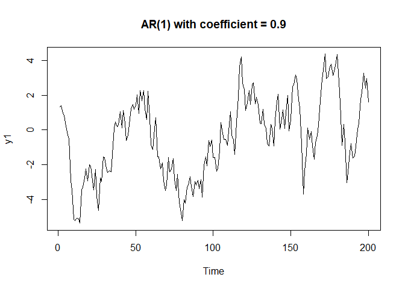
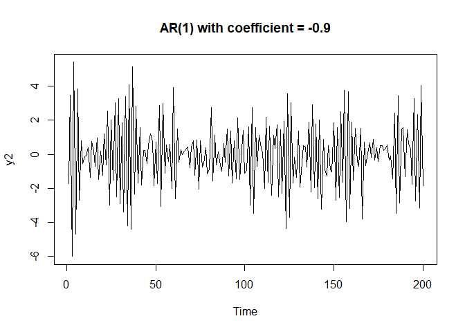
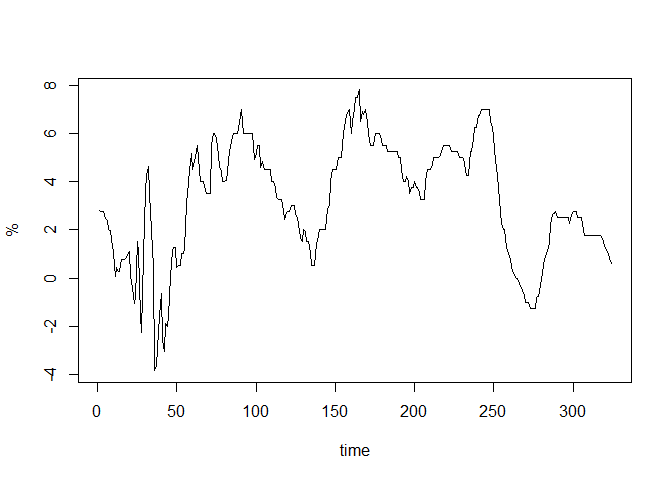
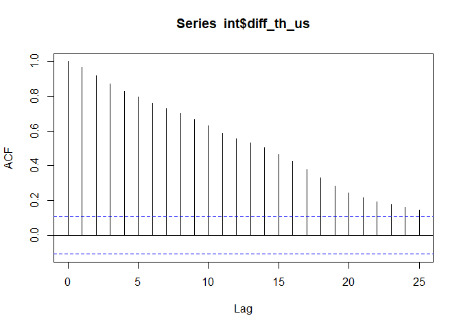
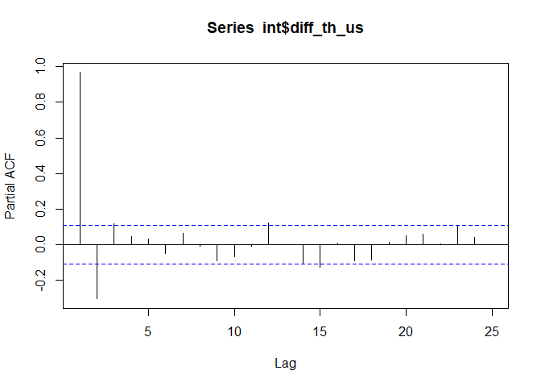
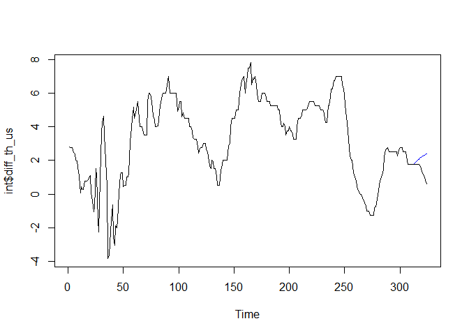

EC435: ตัวอย่างบทที่ 2
================
เฉลิมพงษ์ คงเจริญ

ตัวอย่างข้อมูลที่สร้างจาก process AR(1)
=======================================

``` r
y1<-arima.sim(list(order=c(1,0,0), ar=0.9), n=200)
plot.ts(y1, main="AR(1) with coefficient = 0.9")
```



``` r
y2<-arima.sim(list(order=c(1,0,0), ar=-0.9), n=200)
plot.ts(y2, main="AR(1) with coefficient = -0.9")
```



การพิจาณา Autocorrelation Function (ACF)
========================================

ในการสร้างแบบจำลองอนุกรมเวลา ขั้นตอนแรกของการพิจารณาคือการพิจารณาว่าตัวแปรที่เราสนใจเป็น white noise หรือไม่ ซึ่งหากเป็น white noise แสดงว่าข้อมูลในแต่ละตัวอย่างไม่มีความสัมพันธ์ระหว่างกัน เราไม่สามารถสร้างแบบจำลองอนุกรมเวลาโดยใช้ข้อมูลในอดีตได้ เครื่องมือแรกคือการพิจารณา ACF และเรายังสามารถใช้ ACF และ PACF ในการเลือกรูปแบบของแบบจำลองที่เหมาะสมได้

ในตัวอย่างนี้ (ตัวอย่าง 2.3) เราพิจารณาข้อมูลความแตกต่างระหว่างอัตราดอกเบี้ยลูกค้าชั้นดีของไทยและสหรัฐอเมริกา

``` r
int<-read.csv("https://raw.githubusercontent.com/chaleampong/EC435/master/mlr.csv", header = TRUE)
head(int)
```

    ##    month   MLR Usprime diff_th_us
    ## 1 Jan-78 10.75    7.93       2.82
    ## 2 Feb-78 10.75    8.00       2.75
    ## 3 Mar-78 10.75    8.00       2.75
    ## 4 Apr-78 10.75    8.00       2.75
    ## 5 May-78 10.75    8.27       2.48
    ## 6 Jun-78 11.00    8.63       2.37

``` r
ts.plot(int$diff_th_us, ylab ="%", xlab="time")
```



หากพิจารณา ACF และ PACF

``` r
acf(int$diff_th_us)
```



``` r
pacf(int$diff_th_us)
```



ประมาณค่าแบบจำลอง AR(3)
=======================

เราสามารถประมาณค่าแบบจำลอง AR(3) ได้ด้วยคำสั่ง `arima` โดยระบุข้อมูล `int$diff_th_us` และ ลำดับใน `c(p,d,q)` ซึ่งในกรณีของแบบจำลอง AR(p) เราจะระบุค่า p และกำหนดให้ d=0, q=0

``` r
m1<-arima(int$diff_th_us, order=c(3,0,0))
m1
```

    ## 
    ## Call:
    ## arima(x = int$diff_th_us, order = c(3, 0, 0))
    ## 
    ## Coefficients:
    ##          ar1      ar2     ar3  intercept
    ##       1.3294  -0.4986  0.1334     3.0553
    ## s.e.  0.0549   0.0878  0.0549     0.8102
    ## 
    ## sigma^2 estimated as 0.3054:  log likelihood = -269.11,  aic = 548.21

เราสามารถเลือกวิธีการในการประมาณค่า

``` r
m2<-arima(int$diff_th_us, order=c(3,0,0), method=c("ML"))
m2
```

    ## 
    ## Call:
    ## arima(x = int$diff_th_us, order = c(3, 0, 0), method = c("ML"))
    ## 
    ## Coefficients:
    ##          ar1      ar2     ar3  intercept
    ##       1.3295  -0.4987  0.1334      3.056
    ## s.e.  0.0549   0.0878  0.0549      0.810
    ## 
    ## sigma^2 estimated as 0.3054:  log likelihood = -269.11,  aic = 548.21

เราสามารถเช็ครากของ polynomial จะเห็นได้ว่าคำตอบมีทั้งที่เป็น real และ complex number ดังนั้นเราพิจารณามอดูลัสจะพบว่ามีค่าน้อยกว่า 1 แสดงว่าอนุกรมเวลาไม่นิ่ง (nonstationary)

``` r
p1<-m1$coef
roots<-polyroot(p1)
roots
```

    ## [1]  0.4008889+0.5949388i -0.8454280-0.0000000i  0.4008889-0.5949388i

``` r
Mod(roots)
```

    ## [1] 0.7174009 0.8454280 0.7174009

การทดสอบความเพียงพอของแบบจำลอง
------------------------------

``` r
adqtest<-Box.test(m1$residuals, lag=12, type="Ljung")
adqtest
```

    ## 
    ##  Box-Ljung test
    ## 
    ## data:  m1$residuals
    ## X-squared = 14.009, df = 12, p-value = 0.3002

``` r
#calculate p-value with df=12-3
pv<-1-pchisq(adqtest$statistic, 9)
```

การพยากรณ์
==========

เราสามารถพยากรณ์ได้ด้วยคำสั่ง `predict` และเลือกแบบจำลอง `m1` และเวลาที่จะพยากรณ์ไปข้างหน้า `n.ahead=12`

``` r
predict(m1, n.ahead=12)
```

    ## $pred
    ## Time Series:
    ## Start = 325 
    ## End = 336 
    ## Frequency = 1 
    ##  [1] 0.6315599 0.7591960 0.8838012 0.9900253 1.0861380 1.1775686 1.2653645
    ##  [8] 1.3493145 1.4293392 1.5055784 1.5782294 1.6474738
    ## 
    ## $se
    ## Time Series:
    ## Start = 325 
    ## End = 336 
    ## Frequency = 1 
    ##  [1] 0.5526068 0.9192767 1.1561316 1.3212131 1.4504817 1.5586128 1.6512076
    ##  [8] 1.7312090 1.8008091 1.8617626 1.9154472 1.9629439

เราสามารถเปรียบเทียบความสามารถในการพยากรณ์โดยใช้การพยากรณ์ออกไปนอกช่วย (out-of-sample) ซึ่งเรามีข้อมูลทั้งหมด 324 ตัวอย่าง หากเราแบ่งข้อมูลเป็นช่วงประมาณค่า (1-312) และใช้ช่วง (313-324) สำหรับเปรียบเทียบ

``` r
length(int$diff_th_us)
```

    ## [1] 324

``` r
m3<-arima(int$diff_th_us[1:312], order=c(3,0,0))
m3.prediction<-predict(m3, n.ahead=12)
#comparing real and prediction series
ts.plot(int$diff_th_us)
points(m3.prediction$pred, col="blue", type="l")
```


