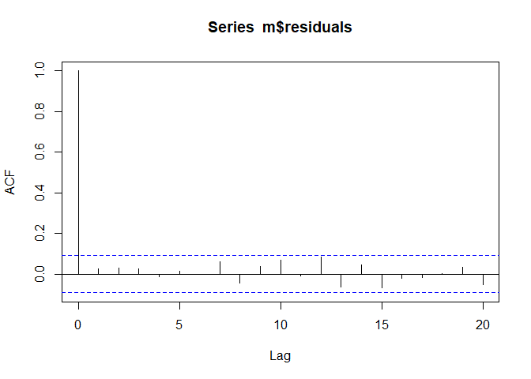
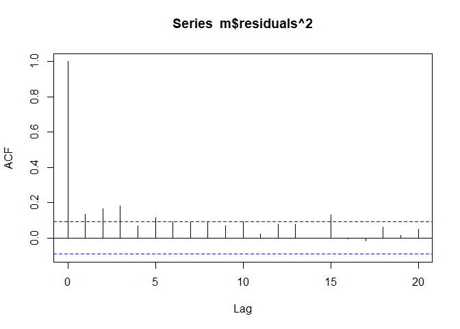
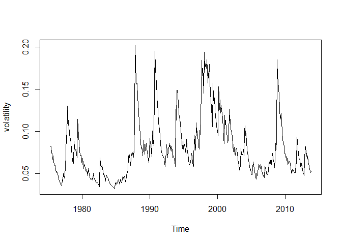

EC435: ตัวอย่างบทที่ 4
================
เฉลิมพงษ์ คงเจริญ

แบบจำลอง ARCH/GARCH
===================

ประมาณค่าแบบจำลองสำหรับอธิบาย log return ของดัชนีราคาตลาดหลักทรัพย์แห่งประเทศไทย (ตัวอย่างที่ 4.1)
--------------------------------------------------------------------------------------------------

จากคำสั่งข้างล่างเราพบว่าแบบจำลองที่เหมาะสมสำหรับ log return ของดัชนีราคาตลาดหลักทรัพย์แห่งประเทศไทยคือ ARMA(2,2)

``` r
mset <- read.csv("https://raw.githubusercontent.com/chaleampong/EC435/master/mset.csv", header = FALSE)
head(mset)
```

    ##       V1
    ## 1 100.00
    ## 2  89.98
    ## 3  91.64
    ## 4  98.02
    ## 5  98.39
    ## 6  92.10

``` r
ret<-diff(log(mset$V1))
library(forecast)
auto.arima(ret, max.p=6, max.q=6, ic=c("aic"))
```

    ## Series: ret 
    ## ARIMA(2,0,2) with zero mean 
    ## 
    ## Coefficients:
    ##          ar1      ar2      ma1     ma2
    ##       1.1154  -0.9020  -1.0542  0.9141
    ## s.e.  0.0511   0.0754   0.0646  0.0740
    ## 
    ## sigma^2 estimated as 0.006749:  log likelihood=489.01
    ## AIC=-968.03   AICc=-967.89   BIC=-947.47

การพิจารณา ARCH Effect
----------------------

เราจะพิจารณาว่าเราต้องเพิ่มส่วนของ conditional mean เข้าไปในแบบจำลองหรือไม่ โดยการทดสอบค่ายกกำลังสองของ residuals ว่าเป็น white noise หรือไม่ ถ้าไม่เป็น แสดงว่า residualas ยกกำลังสองสัมพ้นธ์หรือ เราเรียกว่า ARCH effect

จาก ACF จะเห็นได้ว่าบาง lag มีสหสัมพันธ์หรือ ARCH effect และเมื่อพิจารณา white noise test กับ residuals กำลังสองจะได้ข้อสรุปเช่นเดียวกัน

``` r
m <- arima(ret, order=c(2,0,2))
acf(m$residuals, lag.max=20)
```



``` r
Box.test(m$residuals, lag=12, type="Ljung")
```

    ## 
    ##  Box-Ljung test
    ## 
    ## data:  m$residuals
    ## X-squared = 10.191, df = 12, p-value = 0.5992

``` r
acf(m$residuals^2, lag.max = 20)
```



``` r
Box.test(m$residuals^2, lag=12, type="Ljung")
```

    ## 
    ##  Box-Ljung test
    ## 
    ## data:  m$residuals^2
    ## X-squared = 64.509, df = 12, p-value = 3.36e-09

นอกจากนี้เราสามารถใช้ `ArchTest` ใน package `FinTS` ได้

    ## Loading required package: zoo

    ## 
    ## Attaching package: 'zoo'

    ## The following objects are masked from 'package:base':
    ## 
    ##     as.Date, as.Date.numeric

    ## 
    ## Attaching package: 'FinTS'

    ## The following object is masked from 'package:forecast':
    ## 
    ##     Acf

    ## 
    ##  ARCH LM-test; Null hypothesis: no ARCH effects
    ## 
    ## data:  ret
    ## Chi-squared = 35.547, df = 12, p-value = 0.000383

แบบจำลอง ARCH
=============

เราใช้ package `rugarch` ในการประมาณค่าแบบจำลอง ARCH ซึ่งเป็นส่วนที่ประมาณค่า conditional variance เพิ่มขึ้นจากแบบจำลองที่อธิบาย conditional mean เช่น ARMA(2,2)

ในการสร้างแบบจำลองเราจะต้องระบุรูปแบบของแบบจำลอง `ugarchspec` โดยที่ ugarchspec คือการระบุรูปแบบของ univariate GARCH

-   variance.model=list(model="sGARCH", garchOrder=c(1,0)) ส่วนนี้ระบุรูปแบบของ conditional variance เป็น standard GARCH (sGARCH) และอันดับ c(1,0) คือ q=1 (ARCH(q))
-   mean.model=list(armaOrder=c(2,2), include.mean=TRUE) ส่วนนี้ระบุรูปแบบของ conditional mean เป็น ARMA(2,2) และมีส่วนของค่าคงที่ (include.mean = TRUE)
-   distribution.model = "norm" ส่วนนี้ระบุการแจกแจงเป็นแบบปกติ

<!-- -->

    ## Loading required package: parallel

    ## 
    ## Attaching package: 'rugarch'

    ## The following object is masked from 'package:stats':
    ## 
    ##     sigma

    ## 
    ## *---------------------------------*
    ## *          GARCH Model Fit        *
    ## *---------------------------------*
    ## 
    ## Conditional Variance Dynamics    
    ## -----------------------------------
    ## GARCH Model  : sGARCH(1,0)
    ## Mean Model   : ARFIMA(2,0,2)
    ## Distribution : norm 
    ## 
    ## Convergence Problem:
    ## Solver Message:

แบบจำลอง GARCH
==============

    ## 
    ## *---------------------------------*
    ## *          GARCH Model Fit        *
    ## *---------------------------------*
    ## 
    ## Conditional Variance Dynamics    
    ## -----------------------------------
    ## GARCH Model  : sGARCH(1,1)
    ## Mean Model   : ARFIMA(2,0,2)
    ## Distribution : norm 
    ## 
    ## Optimal Parameters
    ## ------------------------------------
    ##         Estimate  Std. Error  t value Pr(>|t|)
    ## mu      0.005168    0.003323   1.5552 0.119893
    ## ar1     0.929774    0.105519   8.8114 0.000000
    ## ar2    -0.741403    0.131759  -5.6270 0.000000
    ## ma1    -0.885132    0.079630 -11.1155 0.000000
    ## ma2     0.813870    0.126564   6.4305 0.000000
    ## omega   0.000194    0.000084   2.3165 0.020528
    ## alpha1  0.221012    0.045507   4.8567 0.000001
    ## beta1   0.777524    0.038916  19.9795 0.000000
    ## 
    ## Robust Standard Errors:
    ##         Estimate  Std. Error  t value Pr(>|t|)
    ## mu      0.005168    0.004069   1.2701 0.204050
    ## ar1     0.929774    0.134138   6.9315 0.000000
    ## ar2    -0.741403    0.245777  -3.0166 0.002557
    ## ma1    -0.885132    0.082263 -10.7597 0.000000
    ## ma2     0.813870    0.253515   3.2103 0.001326
    ## omega   0.000194    0.000120   1.6161 0.106077
    ## alpha1  0.221012    0.063004   3.5079 0.000452
    ## beta1   0.777524    0.051986  14.9564 0.000000
    ## 
    ## LogLikelihood : 542.9161 
    ## 
    ## Information Criteria
    ## ------------------------------------
    ##                     
    ## Akaike       -2.3721
    ## Bayes        -2.2992
    ## Shibata      -2.3727
    ## Hannan-Quinn -2.3434
    ## 
    ## Weighted Ljung-Box Test on Standardized Residuals
    ## ------------------------------------
    ##                          statistic   p-value
    ## Lag[1]                       3.351 6.717e-02
    ## Lag[2*(p+q)+(p+q)-1][11]     9.220 1.777e-06
    ## Lag[4*(p+q)+(p+q)-1][19]    13.350 8.841e-02
    ## d.o.f=4
    ## H0 : No serial correlation
    ## 
    ## Weighted Ljung-Box Test on Standardized Squared Residuals
    ## ------------------------------------
    ##                         statistic p-value
    ## Lag[1]                     0.0957  0.7571
    ## Lag[2*(p+q)+(p+q)-1][5]    1.8392  0.6569
    ## Lag[4*(p+q)+(p+q)-1][9]    3.0164  0.7563
    ## d.o.f=2
    ## 
    ## Weighted ARCH LM Tests
    ## ------------------------------------
    ##             Statistic Shape Scale P-Value
    ## ARCH Lag[3]     1.876 0.500 2.000  0.1708
    ## ARCH Lag[5]     3.360 1.440 1.667  0.2417
    ## ARCH Lag[7]     3.586 2.315 1.543  0.4103
    ## 
    ## Nyblom stability test
    ## ------------------------------------
    ## Joint Statistic:  1.6738
    ## Individual Statistics:              
    ## mu     0.16604
    ## ar1    0.10449
    ## ar2    0.20001
    ## ma1    0.04106
    ## ma2    0.07696
    ## omega  0.08131
    ## alpha1 0.06439
    ## beta1  0.11916
    ## 
    ## Asymptotic Critical Values (10% 5% 1%)
    ## Joint Statistic:          1.89 2.11 2.59
    ## Individual Statistic:     0.35 0.47 0.75
    ## 
    ## Sign Bias Test
    ## ------------------------------------
    ##                    t-value   prob sig
    ## Sign Bias           0.4548 0.6495    
    ## Negative Sign Bias  0.7298 0.4659    
    ## Positive Sign Bias  0.5408 0.5889    
    ## Joint Effect        1.3410 0.7194    
    ## 
    ## 
    ## Adjusted Pearson Goodness-of-Fit Test:
    ## ------------------------------------
    ##   group statistic p-value(g-1)
    ## 1    20     19.20       0.4441
    ## 2    30     32.53       0.2973
    ## 3    40     40.26       0.4141
    ## 4    50     51.11       0.3909
    ## 
    ## 
    ## Elapsed time : 0.1424191

การพยากรณ์ conditional variance
===============================

เราสามารถคำนวณค่า predicted conditional standard deviation ได้จากคำสั่ง `sigma` จากรูปจะเห็นได้ว่าช่วงที่ตลาดหุ้นไทยผ้นผวนค่อนข้างสูงและยาวนานคือหลังวิกฤติ 1997

``` r
sig.garch11<-sigma(fit.garch11)
volatility<-ts(data=sig.garch11[,1], frequency=12, start=c(1975,5), end=c(2013,11))
plot.ts(volatility, type="l")
```



เราสามารถพยากรณ์ไปข้างหน้า โดยใช้คำสั่ง `ugarchforecast`ซึ่งจะให้ทั้งค่าพยากรณ์ของตัวแปร (series) และ conditional standard deviation

``` r
garch11.fcst=ugarchforecast(fit.garch11, n.ahead=5)
garch11.fcst
```

    ## 
    ## *------------------------------------*
    ## *       GARCH Model Forecast         *
    ## *------------------------------------*
    ## Model: sGARCH
    ## Horizon: 5
    ## Roll Steps: 0
    ## Out of Sample: 0
    ## 
    ## 0-roll forecast [T0=1971-03-28 07:00:00]:
    ##         Series   Sigma
    ## T+1  0.0008783 0.04438
    ## T+2 -0.0026793 0.04648
    ## T+3  0.0010525 0.04849
    ## T+4  0.0071598 0.05041
    ## T+5  0.0100715 0.05226

การประมาณค่าด้วย t-distribution
===============================

    ## 
    ## *---------------------------------*
    ## *          GARCH Model Fit        *
    ## *---------------------------------*
    ## 
    ## Conditional Variance Dynamics    
    ## -----------------------------------
    ## GARCH Model  : sGARCH(1,1)
    ## Mean Model   : ARFIMA(2,0,2)
    ## Distribution : std 
    ## 
    ## Optimal Parameters
    ## ------------------------------------
    ##         Estimate  Std. Error  t value Pr(>|t|)
    ## mu      0.005531    0.003261   1.6962 0.089852
    ## ar1     0.977050    0.175427   5.5695 0.000000
    ## ar2    -0.602677    0.150885  -3.9943 0.000065
    ## ma1    -0.880078    0.155925  -5.6443 0.000000
    ## ma2     0.648087    0.154766   4.1875 0.000028
    ## omega   0.000156    0.000104   1.4966 0.134492
    ## alpha1  0.184988    0.056949   3.2483 0.001161
    ## beta1   0.814012    0.051417  15.8317 0.000000
    ## shape   4.918851    1.144499   4.2978 0.000017
    ## 
    ## Robust Standard Errors:
    ##         Estimate  Std. Error  t value Pr(>|t|)
    ## mu      0.005531    0.004108   1.3462 0.178247
    ## ar1     0.977050    0.160414   6.0908 0.000000
    ## ar2    -0.602677    0.197605  -3.0499 0.002289
    ## ma1    -0.880078    0.125346  -7.0212 0.000000
    ## ma2     0.648087    0.231007   2.8055 0.005024
    ## omega   0.000156    0.000133   1.1675 0.242994
    ## alpha1  0.184988    0.062573   2.9564 0.003113
    ## beta1   0.814012    0.057869  14.0665 0.000000
    ## shape   4.918851    1.020606   4.8195 0.000001
    ## 
    ## LogLikelihood : 558.6078 
    ## 
    ## Information Criteria
    ## ------------------------------------
    ##                     
    ## Akaike       -2.4373
    ## Bayes        -2.3552
    ## Shibata      -2.4381
    ## Hannan-Quinn -2.4050
    ## 
    ## Weighted Ljung-Box Test on Standardized Residuals
    ## ------------------------------------
    ##                          statistic p-value
    ## Lag[1]                      0.7632  0.3823
    ## Lag[2*(p+q)+(p+q)-1][11]    6.6268  0.1495
    ## Lag[4*(p+q)+(p+q)-1][19]   10.3381  0.4131
    ## d.o.f=4
    ## H0 : No serial correlation
    ## 
    ## Weighted Ljung-Box Test on Standardized Squared Residuals
    ## ------------------------------------
    ##                         statistic p-value
    ## Lag[1]                    0.07881  0.7789
    ## Lag[2*(p+q)+(p+q)-1][5]   1.87368  0.6486
    ## Lag[4*(p+q)+(p+q)-1][9]   3.06916  0.7475
    ## d.o.f=2
    ## 
    ## Weighted ARCH LM Tests
    ## ------------------------------------
    ##             Statistic Shape Scale P-Value
    ## ARCH Lag[3]     2.079 0.500 2.000  0.1493
    ## ARCH Lag[5]     3.429 1.440 1.667  0.2333
    ## ARCH Lag[7]     3.664 2.315 1.543  0.3976
    ## 
    ## Nyblom stability test
    ## ------------------------------------
    ## Joint Statistic:  2.4693
    ## Individual Statistics:             
    ## mu     0.3705
    ## ar1    0.3863
    ## ar2    0.3254
    ## ma1    0.1888
    ## ma2    0.1829
    ## omega  0.3653
    ## alpha1 0.1360
    ## beta1  0.2609
    ## shape  0.4106
    ## 
    ## Asymptotic Critical Values (10% 5% 1%)
    ## Joint Statistic:          2.1 2.32 2.82
    ## Individual Statistic:     0.35 0.47 0.75
    ## 
    ## Sign Bias Test
    ## ------------------------------------
    ##                    t-value   prob sig
    ## Sign Bias           0.1496 0.8812    
    ## Negative Sign Bias  0.6621 0.5083    
    ## Positive Sign Bias  0.0224 0.9821    
    ## Joint Effect        0.8860 0.8288    
    ## 
    ## 
    ## Adjusted Pearson Goodness-of-Fit Test:
    ## ------------------------------------
    ##   group statistic p-value(g-1)
    ## 1    20     23.90       0.2000
    ## 2    30     24.81       0.6881
    ## 3    40     37.60       0.5336
    ## 4    50     42.02       0.7498
    ## 
    ## 
    ## Elapsed time : 0.1594341
