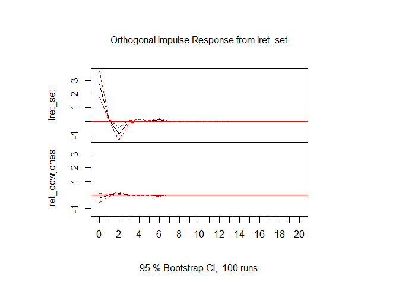
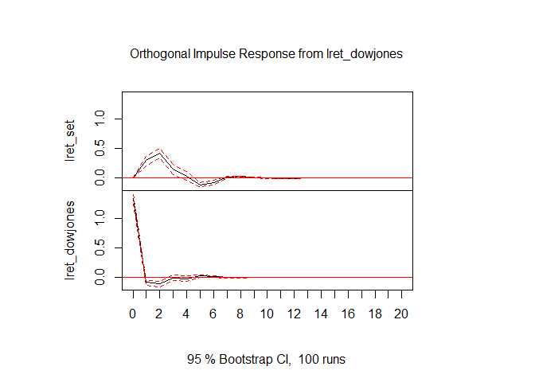

EC435 ตัวอย่างบทที่ 5
================
เฉลิมพงษ์ คงเจริญ

แบบจำลอง Vector Autoregressive (VAR)
====================================

ตัวอย่างที่ 5.3 พิจารณาความสัมพันธ์ระหว่างผลได้ตอบแทนรายวันจากการลงทุนในตลาดหลักทรัพย์แห่งประเทศไทย (lret\_set) และตลาดหุ้นดาวน์โจนส์ (lret\_dowjones)

``` r
setdj <-read.csv("https://raw.githubusercontent.com/chaleampong/EC435/master/set_dj.csv",
               header = TRUE, stringsAsFactors = FALSE)
head(setdj)
```

    ##       date    set dowjones
    ## 1 01/02/97 803.13  6442.49
    ## 2 01/03/97 787.47  6544.09
    ## 3 01/06/97 790.23  6567.18
    ## 4 01/07/97 820.11  6600.66
    ## 5 01/08/97 831.93  6549.48
    ## 6 01/09/97 843.22  6625.67

``` r
lret_set<-diff(log(setdj$set))*100
lret_dowjones<-diff(log(setdj$dowjones))*100
```

สร้างเมทริกซ์ของข้อมูล
----------------------

``` r
lret<-cbind(lret_set, lret_dowjones)
head(lret)
```

    ##        lret_set lret_dowjones
    ## [1,] -1.9691319     1.5647241
    ## [2,]  0.3498768     0.3522164
    ## [3,]  3.7114435     0.5085127
    ## [4,]  1.4309825    -0.7783987
    ## [5,]  1.3479594     1.1565842
    ## [6,] -0.3230944     1.1721539

สร้างแบบจำลอง VAR
-----------------

เราใช้ package `vars` ในการประมาณค่า VAR โดยสามารถใช้ model selection เช่น SIC ในการเลือก lag

    ## Loading required package: MASS

    ## Loading required package: strucchange

    ## Loading required package: zoo

    ## 
    ## Attaching package: 'zoo'

    ## The following objects are masked from 'package:base':
    ## 
    ##     as.Date, as.Date.numeric

    ## Loading required package: sandwich

    ## Loading required package: urca

    ## Loading required package: lmtest

    ## 
    ## VAR Estimation Results:
    ## ======================= 
    ## 
    ## Estimated coefficients for equation lret_set: 
    ## ============================================= 
    ## Call:
    ## lret_set = lret_set.l1 + lret_dowjones.l1 + lret_set.l2 + lret_dowjones.l2 + lret_set.l3 + lret_dowjones.l3 + lret_set.l4 + lret_dowjones.l4 + const 
    ## 
    ##      lret_set.l1 lret_dowjones.l1      lret_set.l2 lret_dowjones.l2 
    ##      0.059620847      0.222803943     -0.320847446      0.313003739 
    ##      lret_set.l3 lret_dowjones.l3      lret_set.l4 lret_dowjones.l4 
    ##      0.023839626      0.205040539     -0.103470694      0.151876380 
    ##            const 
    ##      0.002528587 
    ## 
    ## 
    ## Estimated coefficients for equation lret_dowjones: 
    ## ================================================== 
    ## Call:
    ## lret_dowjones = lret_set.l1 + lret_dowjones.l1 + lret_set.l2 + lret_dowjones.l2 + lret_set.l3 + lret_dowjones.l3 + lret_set.l4 + lret_dowjones.l4 + const 
    ## 
    ##      lret_set.l1 lret_dowjones.l1      lret_set.l2 lret_dowjones.l2 
    ##     -0.003761613     -0.063404654      0.055801434     -0.085282581 
    ##      lret_set.l3 lret_dowjones.l3      lret_set.l4 lret_dowjones.l4 
    ##     -0.001405528     -0.028128741      0.020083474     -0.042956429 
    ##            const 
    ##      0.022422998

    ## 
    ## VAR Estimation Results:
    ## ========================= 
    ## Endogenous variables: lret_set, lret_dowjones 
    ## Deterministic variables: const 
    ## Sample size: 3803 
    ## Log Likelihood: -15650.859 
    ## Roots of the characteristic polynomial:
    ##  0.62  0.62 0.5867 0.5867 0.3557 0.3557 0.2886 0.2886
    ## Call:
    ## VAR(y = lret, p = 4)
    ## 
    ## 
    ## Estimation results for equation lret_set: 
    ## ========================================= 
    ## lret_set = lret_set.l1 + lret_dowjones.l1 + lret_set.l2 + lret_dowjones.l2 + lret_set.l3 + lret_dowjones.l3 + lret_set.l4 + lret_dowjones.l4 + const 
    ## 
    ##                   Estimate Std. Error t value Pr(>|t|)    
    ## lret_set.l1       0.059621   0.016288   3.660 0.000255 ***
    ## lret_dowjones.l1  0.222804   0.032471   6.862 7.91e-12 ***
    ## lret_set.l2      -0.320847   0.016256 -19.738  < 2e-16 ***
    ## lret_dowjones.l2  0.313004   0.032696   9.573  < 2e-16 ***
    ## lret_set.l3       0.023840   0.016122   1.479 0.139313    
    ## lret_dowjones.l3  0.205041   0.032958   6.221 5.47e-10 ***
    ## lret_set.l4      -0.103471   0.016011  -6.462 1.16e-10 ***
    ## lret_dowjones.l4  0.151876   0.032994   4.603 4.30e-06 ***
    ## const             0.002529   0.043532   0.058 0.953684    
    ## ---
    ## Signif. codes:  0 '***' 0.001 '**' 0.01 '*' 0.05 '.' 0.1 ' ' 1
    ## 
    ## 
    ## Residual standard error: 2.683 on 3794 degrees of freedom
    ## Multiple R-Squared: 0.1409,  Adjusted R-squared: 0.1391 
    ## F-statistic: 77.78 on 8 and 3794 DF,  p-value: < 2.2e-16 
    ## 
    ## 
    ## Estimation results for equation lret_dowjones: 
    ## ============================================== 
    ## lret_dowjones = lret_set.l1 + lret_dowjones.l1 + lret_set.l2 + lret_dowjones.l2 + lret_set.l3 + lret_dowjones.l3 + lret_set.l4 + lret_dowjones.l4 + const 
    ## 
    ##                   Estimate Std. Error t value Pr(>|t|)    
    ## lret_set.l1      -0.003762   0.008233  -0.457 0.647779    
    ## lret_dowjones.l1 -0.063405   0.016413  -3.863 0.000114 ***
    ## lret_set.l2       0.055801   0.008217   6.791 1.29e-11 ***
    ## lret_dowjones.l2 -0.085283   0.016527  -5.160 2.59e-07 ***
    ## lret_set.l3      -0.001406   0.008149  -0.172 0.863078    
    ## lret_dowjones.l3 -0.028129   0.016659  -1.688 0.091403 .  
    ## lret_set.l4       0.020083   0.008093   2.481 0.013127 *  
    ## lret_dowjones.l4 -0.042956   0.016677  -2.576 0.010041 *  
    ## const             0.022423   0.022004   1.019 0.308257    
    ## ---
    ## Signif. codes:  0 '***' 0.001 '**' 0.01 '*' 0.05 '.' 0.1 ' ' 1
    ## 
    ## 
    ## Residual standard error: 1.356 on 3794 degrees of freedom
    ## Multiple R-Squared: 0.02605, Adjusted R-squared: 0.024 
    ## F-statistic: 12.69 on 8 and 3794 DF,  p-value: < 2.2e-16 
    ## 
    ## 
    ## 
    ## Covariance matrix of residuals:
    ##               lret_set lret_dowjones
    ## lret_set         7.199        -0.556
    ## lret_dowjones   -0.556         1.839
    ## 
    ## Correlation matrix of residuals:
    ##               lret_set lret_dowjones
    ## lret_set        1.0000       -0.1528
    ## lret_dowjones  -0.1528        1.0000

พยากรณ์จากแบบจำลอง VAR
----------------------

เราใช้ฟังก์ชัน `predict` สำหรับการพยากรณ์

    ## $lret_set
    ##             fcst     lower    upper       CI
    ## [1,]  0.23354446 -5.025286 5.492375 5.258830
    ## [2,] -0.01504318 -5.311043 5.280957 5.296000
    ## [3,]  0.08053962 -5.572718 5.733797 5.653258
    ## [4,] -0.02118987 -5.682718 5.640339 5.661528
    ## [5,] -0.04475454 -5.707153 5.617644 5.662399
    ## 
    ## $lret_dowjones
    ##              fcst     lower    upper       CI
    ## [1,] -0.046835523 -2.705029 2.611358 2.658193
    ## [2,]  0.023569365 -2.639844 2.686983 2.663413
    ## [3,]  0.005536266 -2.686514 2.697586 2.692050
    ## [4,]  0.021958580 -2.670142 2.714059 2.692101
    ## [5,]  0.031192947 -2.661288 2.723674 2.692481

การทดสอบ Granger Causality
--------------------------

เราใช้คำสั่ง `causality` ในการทดสอบ Granger Causality โดยการระบุแบบจำลองที่ต้องการทดสอบ และตัวแปรที่เป็นตัวแปรตั้งต้น (cause)

จากการทดสอบ H0: lret\_dowjones ไม่ G.C. lret\_set ค่า F-Stat = 43.595, และ p-value &lt;0.05 เราสามารถปฎิเสธ H0 และยอมรับว่า lret\_dowjones G.C. lret\_set

    ## $Granger
    ## 
    ##  Granger causality H0: lret_dowjones do not Granger-cause lret_set
    ## 
    ## data:  VAR object model1
    ## F-Test = 43.595, df1 = 4, df2 = 7588, p-value < 2.2e-16
    ## 
    ## 
    ## $Instant
    ## 
    ##  H0: No instantaneous causality between: lret_dowjones and
    ##  lret_set
    ## 
    ## data:  VAR object model1
    ## Chi-squared = 86.768, df = 1, p-value < 2.2e-16

    ## $Granger
    ## 
    ##  Granger causality H0: lret_set do not Granger-cause lret_dowjones
    ## 
    ## data:  VAR object model1
    ## F-Test = 11.731, df1 = 4, df2 = 7588, p-value = 1.689e-09
    ## 
    ## 
    ## $Instant
    ## 
    ##  H0: No instantaneous causality between: lret_set and
    ##  lret_dowjones
    ## 
    ## data:  VAR object model1
    ## Chi-squared = 86.768, df = 1, p-value < 2.2e-16

Impulse Response function
-------------------------

เราใช้คำสั่ง irf ในการสร้าง Impulse Response Function

จาก impulse "lret\_dowjones" ที่เพิ่มขึ้น ส่งผลให้ lret\_set ปรับตัวเพิ่มขึ้น และเพิ่มขึ้นสูงสุดใน 2 period แล้วค่อยๆ ปรับตัวลดลง

    ## 
    ## Impulse response coefficients
    ## $lret_set
    ##            lret_set lret_dowjones
    ##  [1,]  2.683126e+00 -2.072364e-01
    ##  [2,]  1.137971e-01  3.046872e-03
    ##  [3,] -9.182763e-01  1.667747e-01
    ##  [4,] -3.167535e-02  1.028199e-03
    ##  [5,]  3.940669e-02 -2.867178e-03
    ##  [6,]  1.318771e-02 -3.067597e-03
    ##  [7,]  1.063613e-01 -2.300226e-02
    ##  [8,] -1.898719e-04  1.400810e-03
    ##  [9,] -4.585226e-02  8.791043e-03
    ## [10,] -4.286911e-03  3.791845e-04
    ## [11,]  3.076018e-03 -2.311969e-04
    ## [12,]  2.567830e-03 -5.152869e-04
    ## [13,]  5.034057e-03 -1.088769e-03
    ## [14,] -4.005304e-04  1.371258e-04
    ## [15,] -2.347111e-03  4.491666e-04
    ## [16,] -3.156174e-04  4.356108e-05
    ## [17,]  2.168756e-04 -2.627620e-05
    ## [18,]  2.203881e-04 -4.374671e-05
    ## [19,]  2.380668e-04 -5.092683e-05
    ## [20,] -4.250121e-05  1.058666e-05
    ## [21,] -1.226455e-04  2.352140e-05
    ## 
    ## $lret_dowjones
    ##            lret_set lret_dowjones
    ##  [1,]  0.000000e+00  1.340319e+00
    ##  [2,]  2.986285e-01 -8.498249e-02
    ##  [3,]  4.183951e-01 -1.100409e-01
    ##  [4,]  1.528333e-01 -8.386810e-03
    ##  [5,]  3.181643e-02 -2.291614e-02
    ##  [6,] -1.112648e-01  2.273216e-02
    ##  [7,] -7.703033e-02  1.585785e-02
    ##  [8,]  2.072707e-02 -4.833520e-03
    ##  [9,]  2.507341e-02 -4.281963e-03
    ## [10,]  8.757971e-03 -1.802873e-03
    ## [11,]  6.173344e-04 -2.757296e-04
    ## [12,] -6.557884e-03  1.366729e-03
    ## [13,] -3.776416e-03  7.218763e-04
    ## [14,]  1.245729e-03 -2.538386e-04
    ## [15,]  1.473463e-03 -2.658688e-04
    ## [16,]  4.935791e-04 -1.029363e-04
    ## [17,] -7.144692e-05  8.101786e-06
    ## [18,] -3.798733e-04  7.740629e-05
    ## [19,] -1.821213e-04  3.505799e-05
    ## [20,]  7.631603e-05 -1.512957e-05
    ## [21,]  8.602405e-05 -1.590660e-05
    ## 
    ## 
    ## Lower Band, CI= 0.95 
    ## $lret_set
    ##            lret_set lret_dowjones
    ##  [1,]  1.774889e+00 -5.664014e-01
    ##  [2,]  4.989086e-02 -4.826132e-02
    ##  [3,] -1.358248e+00  7.087797e-02
    ##  [4,] -1.303134e-01 -3.554633e-02
    ##  [5,] -2.724703e-02 -3.989230e-02
    ##  [6,] -4.564917e-02 -2.250780e-02
    ##  [7,]  3.127831e-02 -4.743270e-02
    ##  [8,] -1.631208e-02 -2.107386e-03
    ##  [9,] -7.417847e-02  3.517105e-03
    ## [10,] -1.458590e-02 -1.683425e-03
    ## [11,] -3.519340e-03 -2.410514e-03
    ## [12,] -2.429150e-03 -2.646586e-03
    ## [13,]  4.410702e-04 -2.958691e-03
    ## [14,] -2.248360e-03 -1.748140e-04
    ## [15,] -4.425157e-03  1.215398e-04
    ## [16,] -1.206391e-03 -9.320966e-05
    ## [17,] -2.801409e-04 -1.674215e-04
    ## [18,] -1.274540e-04 -2.352879e-04
    ## [19,] -2.822331e-05 -1.981931e-04
    ## [20,] -2.181890e-04 -1.153915e-05
    ## [21,] -2.957467e-04  1.452949e-06
    ## 
    ## $lret_dowjones
    ##            lret_set lret_dowjones
    ##  [1,]  0.000000e+00  1.242444e+00
    ##  [2,]  2.107452e-01 -1.308441e-01
    ##  [3,]  3.382205e-01 -1.566606e-01
    ##  [4,]  5.187720e-02 -5.076390e-02
    ##  [5,] -4.195011e-02 -6.237950e-02
    ##  [6,] -1.450640e-01  7.465037e-03
    ##  [7,] -1.194964e-01  4.538196e-03
    ##  [8,]  8.744177e-03 -8.355022e-03
    ##  [9,]  1.323552e-02 -8.030189e-03
    ## [10,]  1.856242e-03 -5.218921e-03
    ## [11,] -6.524635e-03 -1.770000e-03
    ## [12,] -1.015339e-02  1.125091e-04
    ## [13,] -7.128972e-03 -5.474237e-05
    ## [14,] -1.315317e-04 -5.356458e-04
    ## [15,]  5.030194e-04 -6.066321e-04
    ## [16,] -6.266804e-05 -3.866089e-04
    ## [17,] -5.819379e-04 -8.862934e-05
    ## [18,] -7.989609e-04  5.515128e-06
    ## [19,] -4.359321e-04 -7.635385e-06
    ## [20,] -9.902999e-06 -4.549565e-05
    ## [21,]  1.832217e-05 -4.989477e-05
    ## 
    ## 
    ## Upper Band, CI= 0.95 
    ## $lret_set
    ##            lret_set lret_dowjones
    ##  [1,]  3.662744e+00  1.615200e-01
    ##  [2,]  2.021604e-01  4.018427e-02
    ##  [3,] -5.050722e-01  2.525776e-01
    ##  [4,]  6.637899e-02  3.929497e-02
    ##  [5,]  1.110215e-01  3.923181e-02
    ##  [6,]  8.887976e-02  1.583518e-02
    ##  [7,]  1.842775e-01 -2.909828e-03
    ##  [8,]  1.522587e-02  5.526408e-03
    ##  [9,] -1.956943e-02  1.487253e-02
    ## [10,]  4.489138e-03  3.882751e-03
    ## [11,]  8.671015e-03  2.403387e-03
    ## [12,]  1.043387e-02  7.122288e-04
    ## [13,]  1.138995e-02  1.161809e-04
    ## [14,]  8.267698e-04  6.251068e-04
    ## [15,] -6.686191e-04  9.775607e-04
    ## [16,]  3.219501e-04  3.685740e-04
    ## [17,]  7.197460e-04  1.522887e-04
    ## [18,]  9.334738e-04  3.304958e-05
    ## [19,]  7.365094e-04  1.678803e-05
    ## [20,]  5.254424e-05  5.385093e-05
    ## [21,] -1.575133e-05  6.953407e-05
    ## 
    ## $lret_dowjones
    ##            lret_set lret_dowjones
    ##  [1,]  0.000000e+00  1.408211e+00
    ##  [2,]  3.643438e-01 -4.822316e-02
    ##  [3,]  4.985648e-01 -7.224151e-02
    ##  [4,]  2.333377e-01  4.055238e-02
    ##  [5,]  1.164044e-01  2.595599e-02
    ##  [6,] -7.131049e-02  3.772089e-02
    ##  [7,] -3.492615e-02  2.720088e-02
    ##  [8,]  3.101450e-02  1.875195e-04
    ##  [9,]  3.378756e-02 -7.510759e-04
    ## [10,]  1.859484e-02  8.053051e-04
    ## [11,]  6.646141e-03  1.746684e-03
    ## [12,] -2.731961e-03  2.680594e-03
    ## [13,] -9.435476e-04  1.563670e-03
    ## [14,]  2.327578e-03  1.248374e-04
    ## [15,]  2.515335e-03 -6.362774e-05
    ## [16,]  1.308473e-03  8.260431e-05
    ## [17,]  3.732158e-04  1.395230e-04
    ## [18,] -9.022617e-05  1.964629e-04
    ## [19,]  5.897962e-06  1.093700e-04
    ## [20,]  1.941661e-04  8.360250e-06
    ## [21,]  2.096053e-04 -8.336796e-07



Forecast Error Variance Decomposition (FEVD)
--------------------------------------------

เราใช้คำสั่ง fevd ในการหา Forecast Error Variance Decomposition ซึ่งในที่นี้หากพิจารณา FEVD ของ lret\_set ในการพยากรณ์ไปข้างหน้า 20 period จะพบว่า FEV ที่ period ที่ 20 สามารถแบ่งออกเป็น 96.32% จาก lret\_set เอง และอีก 3.68% มีที่มาจาก lret\_dowjones

    ## $lret_set
    ##        lret_set lret_dowjones
    ##  [1,] 1.0000000    0.00000000
    ##  [2,] 0.9877859    0.01221413
    ##  [3,] 0.9682396    0.03176043
    ##  [4,] 0.9655329    0.03446710
    ##  [5,] 0.9654222    0.03457779
    ##  [6,] 0.9639931    0.03600687
    ##  [7,] 0.9633589    0.03664112
    ##  [8,] 0.9633095    0.03669052
    ##  [9,] 0.9632464    0.03675359
    ## [10,] 0.9632377    0.03676233
    ## [11,] 0.9632377    0.03676233
    ## [12,] 0.9632328    0.03676724
    ## [13,] 0.9632312    0.03676877
    ## [14,] 0.9632310    0.03676895
    ## [15,] 0.9632308    0.03676918
    ## [16,] 0.9632308    0.03676920
    ## [17,] 0.9632308    0.03676920
    ## [18,] 0.9632308    0.03676922
    ## [19,] 0.9632308    0.03676922
    ## [20,] 0.9632308    0.03676922
    ## 
    ## $lret_dowjones
    ##         lret_set lret_dowjones
    ##  [1,] 0.02334830     0.9766517
    ##  [2,] 0.02326189     0.9767381
    ##  [3,] 0.03751278     0.9624872
    ##  [4,] 0.03751192     0.9624881
    ##  [5,] 0.03750568     0.9624943
    ##  [6,] 0.03750021     0.9624998
    ##  [7,] 0.03776488     0.9622351
    ##  [8,] 0.03776541     0.9622346
    ##  [9,] 0.03780442     0.9621956
    ## [10,] 0.03780443     0.9621956
    ## [11,] 0.03780446     0.9621955
    ## [12,] 0.03780456     0.9621954
    ## [13,] 0.03780515     0.9621949
    ## [14,] 0.03780516     0.9621948
    ## [15,] 0.03780526     0.9621947
    ## [16,] 0.03780526     0.9621947
    ## [17,] 0.03780526     0.9621947
    ## [18,] 0.03780526     0.9621947
    ## [19,] 0.03780526     0.9621947
    ## [20,] 0.03780526     0.9621947
