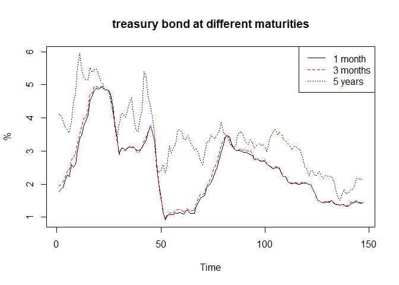

EC435 ตัวอย่างบทที่ 6
================
เฉลิมพงษ์ คงเจริญ

ตัวอย่างการพิจารณาความสัมพันธ์ระหว่าง future กับ sprot prices ของ SET50
=======================================================================

นำเข้าข้อมูล
------------

นำเข้าข้อมูลรายเดือนของราคา future และ spot ของ SET แล้ว แปลงเป็นราคาในรูปของ log

``` r
set50_m <-read.csv("https://raw.githubusercontent.com/chaleampong/EC435/master/set50_m.csv", header = TRUE)
head(set50_m)
```

    ##    Month   spot futures
    ## 1 4/1/06 533.86   537.6
    ## 2 5/1/06 492.52   492.1
    ## 3 6/1/06 471.54   469.3
    ## 4 7/1/06 482.63   475.5
    ## 5 8/1/06 482.43   476.9
    ## 6 9/1/06 480.30   489.5

``` r
lfutures <-(log(set50_m$futures))
lspot <-(log(set50_m$spot))
```

ทดสอบ unit root
---------------

เราทดสอบ Unit root กับ lspot และ lfuture ด้วย Dickey Fuller test โดยใช้คำสั่ง `ur.df` ใน package`urca`

กรณีของ lspot พบว่าค่าสถิติเท่ากับ -1.3151 มากกว่าค่า critical value (-2.88) แสดงว่า lspot เป็น unit root แล้วเมื่อพิจารณา diff(lspot) ค่าสถิติเท่ากับ -7.78 น้อยกว่า critical value แสดงว่า diff(lspot) เป็น stationary ดังนั้น lspot เป็น I(1)

เมื่อเราพิจารณา lfuture เราก็ได้ข้อสรุปเช่นเดียวกัน คือ lfuture เป็น I(1) ดังนั้น เราไม่สามารถประมาณค่า OLS กับตัวแปรทั้งสองได้ ยกเว้นในกรณี Cointegration

``` r
library(urca)
summary(ur.df(lspot, type="drift", selectlags = "BIC"))
```

    ## 
    ## ############################################### 
    ## # Augmented Dickey-Fuller Test Unit Root Test # 
    ## ############################################### 
    ## 
    ## Test regression drift 
    ## 
    ## 
    ## Call:
    ## lm(formula = z.diff ~ z.lag.1 + 1 + z.diff.lag)
    ## 
    ## Residuals:
    ##      Min       1Q   Median       3Q      Max 
    ## -0.35580 -0.03129  0.01343  0.03917  0.12099 
    ## 
    ## Coefficients:
    ##             Estimate Std. Error t value Pr(>|t|)  
    ## (Intercept)  0.15190    0.11230   1.353    0.179  
    ## z.lag.1     -0.02260    0.01719  -1.315    0.191  
    ## z.diff.lag   0.18386    0.08902   2.065    0.041 *
    ## ---
    ## Signif. codes:  0 '***' 0.001 '**' 0.01 '*' 0.05 '.' 0.1 ' ' 1
    ## 
    ## Residual standard error: 0.06481 on 121 degrees of freedom
    ## Multiple R-squared:  0.04321,    Adjusted R-squared:  0.0274 
    ## F-statistic: 2.732 on 2 and 121 DF,  p-value: 0.06908
    ## 
    ## 
    ## Value of test-statistic is: -1.3151 1.15 
    ## 
    ## Critical values for test statistics: 
    ##       1pct  5pct 10pct
    ## tau2 -3.46 -2.88 -2.57
    ## phi1  6.52  4.63  3.81

``` r
summary(ur.df(diff(lspot), type="drift", selectlags = "BIC"))
```

    ## 
    ## ############################################### 
    ## # Augmented Dickey-Fuller Test Unit Root Test # 
    ## ############################################### 
    ## 
    ## Test regression drift 
    ## 
    ## 
    ## Call:
    ## lm(formula = z.diff ~ z.lag.1 + 1 + z.diff.lag)
    ## 
    ## Residuals:
    ##      Min       1Q   Median       3Q      Max 
    ## -0.34370 -0.03055  0.01292  0.04103  0.13773 
    ## 
    ## Coefficients:
    ##              Estimate Std. Error t value Pr(>|t|)    
    ## (Intercept)  0.005054   0.005912   0.855    0.394    
    ## z.lag.1     -0.907150   0.116646  -7.777 2.86e-12 ***
    ## z.diff.lag   0.087958   0.090419   0.973    0.333    
    ## ---
    ## Signif. codes:  0 '***' 0.001 '**' 0.01 '*' 0.05 '.' 0.1 ' ' 1
    ## 
    ## Residual standard error: 0.06521 on 120 degrees of freedom
    ## Multiple R-squared:  0.422,  Adjusted R-squared:  0.4123 
    ## F-statistic:  43.8 on 2 and 120 DF,  p-value: 5.207e-15
    ## 
    ## 
    ## Value of test-statistic is: -7.7769 30.2417 
    ## 
    ## Critical values for test statistics: 
    ##       1pct  5pct 10pct
    ## tau2 -3.46 -2.88 -2.57
    ## phi1  6.52  4.63  3.81

``` r
summary(ur.df(lfutures, type="drift", selectlags = "BIC"))
```

    ## 
    ## ############################################### 
    ## # Augmented Dickey-Fuller Test Unit Root Test # 
    ## ############################################### 
    ## 
    ## Test regression drift 
    ## 
    ## 
    ## Call:
    ## lm(formula = z.diff ~ z.lag.1 + 1 + z.diff.lag)
    ## 
    ## Residuals:
    ##      Min       1Q   Median       3Q      Max 
    ## -0.34489 -0.03106  0.01466  0.04411  0.14917 
    ## 
    ## Coefficients:
    ##             Estimate Std. Error t value Pr(>|t|)
    ## (Intercept)  0.16702    0.12174   1.372    0.173
    ## z.lag.1     -0.02490    0.01864  -1.336    0.184
    ## z.diff.lag   0.13579    0.08971   1.514    0.133
    ## 
    ## Residual standard error: 0.07075 on 121 degrees of freedom
    ## Multiple R-squared:  0.02931,    Adjusted R-squared:  0.01326 
    ## F-statistic: 1.827 on 2 and 121 DF,  p-value: 0.1654
    ## 
    ## 
    ## Value of test-statistic is: -1.3358 1.1551 
    ## 
    ## Critical values for test statistics: 
    ##       1pct  5pct 10pct
    ## tau2 -3.46 -2.88 -2.57
    ## phi1  6.52  4.63  3.81

``` r
summary(ur.df(diff(lfutures), type="drift", selectlags = "BIC"))
```

    ## 
    ## ############################################### 
    ## # Augmented Dickey-Fuller Test Unit Root Test # 
    ## ############################################### 
    ## 
    ## Test regression drift 
    ## 
    ## 
    ## Call:
    ## lm(formula = z.diff ~ z.lag.1 + 1 + z.diff.lag)
    ## 
    ## Residuals:
    ##      Min       1Q   Median       3Q      Max 
    ## -0.33070 -0.03466  0.01173  0.04260  0.16764 
    ## 
    ## Coefficients:
    ##              Estimate Std. Error t value Pr(>|t|)    
    ## (Intercept)  0.005401   0.006441   0.839    0.403    
    ## z.lag.1     -0.973094   0.119893  -8.116 4.76e-13 ***
    ## z.diff.lag   0.101229   0.090226   1.122    0.264    
    ## ---
    ## Signif. codes:  0 '***' 0.001 '**' 0.01 '*' 0.05 '.' 0.1 ' ' 1
    ## 
    ## Residual standard error: 0.0711 on 120 degrees of freedom
    ## Multiple R-squared:  0.4482, Adjusted R-squared:  0.439 
    ## F-statistic: 48.74 on 2 and 120 DF,  p-value: 3.203e-16
    ## 
    ## 
    ## Value of test-statistic is: -8.1164 32.9392 
    ## 
    ## Critical values for test statistics: 
    ##       1pct  5pct 10pct
    ## tau2 -3.46 -2.88 -2.57
    ## phi1  6.52  4.63  3.81

ทดสอบ cointegration กรณีทราบค่าสัมประสิทธิ์
-------------------------------------------

จากทฤษฎีความสัมพันธ์ระหว่างราคา future และ spot เราทราบว่าตัวแปรทั้งสองมีความสัมพันธ์ดังนี้ *l**o**g*(*f**u**t**u**r**e*)=*l**o**g*(*s**p**o**t*)+*c**o**s**t* เราสามารถทดสอบ cointegration โดยแบ่งเป็นสองขั้นตอนดังนี้

1.  สร้างตัวแปร *u* = *l**o**g*(*f**u**t**u**r**e*)−*l**o**g*(*s**p**o**t*)

2.  ทดสอบ unit root กับตัวแปร u พบว่าค่าสถิติเท่ากับ -8.13 ซึ่งน้อยกว่า ค่า critical value (-2.88) เราสามารถปปฏิเสธสมมุติฐานว่า u เป็น unit root และสรุปว่าตัวแปรทั้งสอง cointegrated กัน

``` r
u<-lfutures-lspot
summary(ur.df(u, type="drift", selectlags = "BIC"))
```

    ## 
    ## ############################################### 
    ## # Augmented Dickey-Fuller Test Unit Root Test # 
    ## ############################################### 
    ## 
    ## Test regression drift 
    ## 
    ## 
    ## Call:
    ## lm(formula = z.diff ~ z.lag.1 + 1 + z.diff.lag)
    ## 
    ## Residuals:
    ##       Min        1Q    Median        3Q       Max 
    ## -0.053465 -0.005260  0.000870  0.006958  0.035017 
    ## 
    ## Coefficients:
    ##              Estimate Std. Error t value Pr(>|t|)    
    ## (Intercept) -0.003307   0.001250  -2.645  0.00924 ** 
    ## z.lag.1     -0.899482   0.110577  -8.134 4.14e-13 ***
    ## z.diff.lag   0.175245   0.089293   1.963  0.05199 .  
    ## ---
    ## Signif. codes:  0 '***' 0.001 '**' 0.01 '*' 0.05 '.' 0.1 ' ' 1
    ## 
    ## Residual standard error: 0.0132 on 121 degrees of freedom
    ## Multiple R-squared:  0.4018, Adjusted R-squared:  0.3919 
    ## F-statistic: 40.64 on 2 and 121 DF,  p-value: 3.151e-14
    ## 
    ## 
    ## Value of test-statistic is: -8.1345 33.0866 
    ## 
    ## Critical values for test statistics: 
    ##       1pct  5pct 10pct
    ## tau2 -3.46 -2.88 -2.57
    ## phi1  6.52  4.63  3.81

การทดสอบ cointegration กรณีไม่ทราบค่าสัมประสิทธิ์
-------------------------------------------------

กรณีที่เราไม่ทราบค่าสัมประสิทธิ์ เราสามารถทดสอบ cointegration ได้ดังนี้

1.  ประมาณค่าสมการความสัมพันธ์ระหว่างตัวแปรทั้งสองด้วยสมการดังนี้ *l**o**g*(*f**u**t**u**r**e**s*)=*β*<sub>0</sub> + *β*<sub>1</sub>*l**o**g*(*s**p**o**t*)+*u* ซึ่งในที่นี้ใช้คำสั่ง `lm(lfutures~lspot)` จะได้ผลดังนี้ $\\widehat{lfutures} = -0.044 + 1.006 lspot$ แล้วสร้าง residuals

2.  ทดสอบ unit root กับ residuals ด้วย Dickey Fuller พบว่าค่าสถิติเท่ากับ -8.29 ซึ่งนำไปเปรียบเทียบกับค่า critical value จากตาราง Phillips and Orliaris ซึ่ง จำนวนตัวแปร - 1(n-1)=1 และรูปแบบของสมการ cointegration มีค่าคงที่ หากเลือก significance level ที่ 0.05 จะได้ค่า critical value เท่ากับ -3.3654 ซึ่งค่าสถิติน้อยกว่า c.v. ดังนั้น เราสามารถปฏิเสธสมมุติฐานหลักที่ว่า residuals เป็น unit root และสรุปว่าตัวแปรทั้งสองเป็น cointegration

``` r
m1<- lm(lfutures ~ lspot )
summary(m1)
```

    ## 
    ## Call:
    ## lm(formula = lfutures ~ lspot)
    ## 
    ## Residuals:
    ##       Min        1Q    Median        3Q       Max 
    ## -0.053040 -0.005474  0.001128  0.006023  0.037175 
    ## 
    ## Coefficients:
    ##              Estimate Std. Error t value Pr(>|t|)    
    ## (Intercept) -0.044097   0.023113  -1.908   0.0587 .  
    ## lspot        1.006206   0.003535 284.610   <2e-16 ***
    ## ---
    ## Signif. codes:  0 '***' 0.001 '**' 0.01 '*' 0.05 '.' 0.1 ' ' 1
    ## 
    ## Residual standard error: 0.01349 on 124 degrees of freedom
    ## Multiple R-squared:  0.9985, Adjusted R-squared:  0.9985 
    ## F-statistic: 8.1e+04 on 1 and 124 DF,  p-value: < 2.2e-16

``` r
uhat<- m1$residuals
summary(ur.df(uhat, type="drift", selectlags = "BIC"))
```

    ## 
    ## ############################################### 
    ## # Augmented Dickey-Fuller Test Unit Root Test # 
    ## ############################################### 
    ## 
    ## Test regression drift 
    ## 
    ## 
    ## Call:
    ## lm(formula = z.diff ~ z.lag.1 + 1 + z.diff.lag)
    ## 
    ## Residuals:
    ##       Min        1Q    Median        3Q       Max 
    ## -0.052712 -0.005953  0.001036  0.006614  0.035313 
    ## 
    ## Coefficients:
    ##               Estimate Std. Error t value Pr(>|t|)    
    ## (Intercept) -0.0001084  0.0011708  -0.093   0.9264    
    ## z.lag.1     -0.9224120  0.1112721  -8.290 1.81e-13 ***
    ## z.diff.lag   0.1846947  0.0890896   2.073   0.0403 *  
    ## ---
    ## Signif. codes:  0 '***' 0.001 '**' 0.01 '*' 0.05 '.' 0.1 ' ' 1
    ## 
    ## Residual standard error: 0.01304 on 121 degrees of freedom
    ## Multiple R-squared:  0.4104, Adjusted R-squared:  0.4007 
    ## F-statistic: 42.12 on 2 and 121 DF,  p-value: 1.311e-14
    ## 
    ## 
    ## Value of test-statistic is: -8.2897 34.364 
    ## 
    ## Critical values for test statistics: 
    ##       1pct  5pct 10pct
    ## tau2 -3.46 -2.88 -2.57
    ## phi1  6.52  4.63  3.81

การประมาณค่า Error Correction Model (ECM)
-----------------------------------------

``` r
dlspot = diff(lspot)
dlfutures = diff(lfutures)
uhat<-uhat[2:126]
ecm1<-lm(dlfutures[2:125]~uhat[1:124]+dlfutures[1:124]+dlspot[1:124])
summary(ecm1)
```

    ## 
    ## Call:
    ## lm(formula = dlfutures[2:125] ~ uhat[1:124] + dlfutures[1:124] + 
    ##     dlspot[1:124])
    ## 
    ## Residuals:
    ##      Min       1Q   Median       3Q      Max 
    ## -0.31503 -0.03288  0.01358  0.04233  0.14965 
    ## 
    ## Coefficients:
    ##                   Estimate Std. Error t value Pr(>|t|)  
    ## (Intercept)       0.004115   0.006281   0.655   0.5136  
    ## uhat[1:124]      -1.152182   0.598961  -1.924   0.0568 .
    ## dlfutures[1:124]  0.071715   0.478109   0.150   0.8810  
    ## dlspot[1:124]     0.137282   0.498649   0.275   0.7836  
    ## ---
    ## Signif. codes:  0 '***' 0.001 '**' 0.01 '*' 0.05 '.' 0.1 ' ' 1
    ## 
    ## Residual standard error: 0.06973 on 120 degrees of freedom
    ## Multiple R-squared:  0.06491,    Adjusted R-squared:  0.04154 
    ## F-statistic: 2.777 on 3 and 120 DF,  p-value: 0.04424

``` r
ecm2<-lm(dlspot[2:125]~uhat[1:124]+dlfutures[1:124]+dlspot[1:124])
summary(ecm2)
```

    ## 
    ## Call:
    ## lm(formula = dlspot[2:125] ~ uhat[1:124] + dlfutures[1:124] + 
    ##     dlspot[1:124])
    ## 
    ## Residuals:
    ##      Min       1Q   Median       3Q      Max 
    ## -0.34142 -0.03319  0.01113  0.04038  0.13716 
    ## 
    ## Coefficients:
    ##                   Estimate Std. Error t value Pr(>|t|)
    ## (Intercept)       0.004314   0.005893   0.732    0.466
    ## uhat[1:124]      -0.212277   0.561883  -0.378    0.706
    ## dlfutures[1:124] -0.102953   0.448512  -0.230    0.819
    ## dlspot[1:124]     0.288494   0.467780   0.617    0.539
    ## 
    ## Residual standard error: 0.06541 on 120 degrees of freedom
    ## Multiple R-squared:  0.03337,    Adjusted R-squared:  0.009204 
    ## F-statistic: 1.381 on 3 and 120 DF,  p-value: 0.252

การทดสอบ Johansen's cointegration
=================================

หาอันดับ VECM ที่เหมาะสม
------------------------

ขั้นตอนแรกในการทดสอบ คือการหาอันดับที่เหมาะสมสำหรับ VECM โดยจะเป็นอันดับของ VAR-1

เราประมาณค่า VAR ด้วย package `vars` จะพบว่าอันดับที่เหมาะสมคือ VAR(4) และเราสามารถประมาณค่าแบบจำลอง VECM(3)

    ##      lfutures    lspot
    ## [1,] 6.287115 6.280134
    ## [2,] 6.198682 6.199535
    ## [3,] 6.151242 6.156004
    ## [4,] 6.164367 6.179250
    ## [5,] 6.167307 6.178836
    ## [6,] 6.193384 6.174411

    ## Loading required package: MASS

    ## Loading required package: strucchange

    ## Loading required package: zoo

    ## 
    ## Attaching package: 'zoo'

    ## The following objects are masked from 'package:base':
    ## 
    ##     as.Date, as.Date.numeric

    ## Loading required package: sandwich

    ## Loading required package: lmtest

    ## 
    ## VAR Estimation Results:
    ## ======================= 
    ## 
    ## Estimated coefficients for equation lfutures: 
    ## ============================================= 
    ## Call:
    ## lfutures = lfutures.l1 + lspot.l1 + lfutures.l2 + lspot.l2 + lfutures.l3 + lspot.l3 + lfutures.l4 + lspot.l4 + const 
    ## 
    ## lfutures.l1    lspot.l1 lfutures.l2    lspot.l2 lfutures.l3    lspot.l3 
    ##  0.03901903  1.20084532  0.06312604 -0.48169298 -0.91804903  1.40139010 
    ## lfutures.l4    lspot.l4       const 
    ##  0.37178420 -0.69722519  0.13406246 
    ## 
    ## 
    ## Estimated coefficients for equation lspot: 
    ## ========================================== 
    ## Call:
    ## lspot = lfutures.l1 + lspot.l1 + lfutures.l2 + lspot.l2 + lfutures.l3 + lspot.l3 + lfutures.l4 + lspot.l4 + const 
    ## 
    ## lfutures.l1    lspot.l1 lfutures.l2    lspot.l2 lfutures.l3    lspot.l3 
    ##  -0.1738544   1.3769259   0.1714170  -0.5291331  -0.6237252   1.0354564 
    ## lfutures.l4    lspot.l4       const 
    ##   0.3430320  -0.6255168   0.1684990

ทดสอบ Johansen's test
=====================

เราทดสอบ Johansen's test โดยใช้คำสั่ง `ca.jo` ใน package `urca` โดยระบุตัวสถิติที่ใช้คือ trace statistic ด้วย `type=c("trace")` และรูปแบบของ cointegration มีค่าคงที่ `ecdet=c("const")` และจำนวนอันดับของ VAR `k=4`โดยเก็บผลไว้ในชื่อ `fsprice.rc` และเรียกดูผลด้วย `summary(fsprice.rc)`

จะได้ค่าสถิติซึ่งมีการทดสอบแบบเป็นลำดับ

-   *H*<sub>0</sub> : *r* = 0 vs *H*<sub>1</sub> : *r* &gt; 0 ค่าสถิติ 43.89 มากกว่าค่า c.v.19.96 กรณี significance level = 0.05 เราสามารถปฏิเสธสมมุติฐานหลัก และสรุปว่า r&gt;0

-   *H*<sub>0</sub> : *r* = 1 vs *H*<sub>1</sub> : *r* &gt; 1 ค่าสถิติ 3.01 น้อยกว่าค่า c.v. 9.24 กรณี significance level = 0.05 เราไม่สามารถปฏิเสธสมมุติฐานหลัก และยอมรับว่า r=1 หรือ lfutures และ lspot มี cointegration 1 ความสัมพันธ์

<!-- -->

    ## 
    ## ###################### 
    ## # Johansen-Procedure # 
    ## ###################### 
    ## 
    ## Test type: trace statistic , without linear trend and constant in cointegration 
    ## 
    ## Eigenvalues (lambda):
    ## [1] 2.847322e-01 2.434360e-02 2.081668e-17
    ## 
    ## Values of teststatistic and critical values of test:
    ## 
    ##           test 10pct  5pct  1pct
    ## r <= 1 |  3.01  7.52  9.24 12.97
    ## r = 0  | 43.89 17.85 19.96 24.60
    ## 
    ## Eigenvectors, normalised to first column:
    ## (These are the cointegration relations)
    ## 
    ##             lfutures.l4  lspot.l4  constant
    ## lfutures.l4  1.00000000  1.000000  1.000000
    ## lspot.l4    -1.00451521 -1.422650 -1.256829
    ## constant     0.03337561  2.822588  1.482432
    ## 
    ## Weights W:
    ## (This is the loading matrix)
    ## 
    ##            lfutures.l4   lspot.l4      constant
    ## lfutures.d  -1.5094647 0.06534493 -1.823573e-13
    ## lspot.d     -0.3469295 0.06379890 -3.903367e-14

เราสามารถประมาณค่าแบบจำลอง VECM ด้วยคำสั่ง `cajorls` และระบุความสัมพันธ์ตามผลการทดสอบ `r=1`

    ## $rlm
    ## 
    ## Call:
    ## lm(formula = substitute(form1), data = data.mat)
    ## 
    ## Coefficients:
    ##               lfutures.d  lspot.d 
    ## ect1          -1.50946    -0.34693
    ## lfutures.dl1  -0.98859    -0.20081
    ## lspot.dl1      1.24993     0.42485
    ## lfutures.dl2  -0.92914    -0.03298
    ## lspot.dl2      0.76844    -0.10408
    ## lfutures.dl3  -1.86016    -0.66937
    ## lspot.dl3      2.18017     0.94147
    ## 
    ## 
    ## $beta
    ##                    ect1
    ## lfutures.l4  1.00000000
    ## lspot.l4    -1.00451521
    ## constant     0.03337561

ตัวอย่างความสัมพันธ์ระหว่างผลตอบแทนพันธบัตรรัฐบาล
=================================================

VECM กรณีมีตัวแปรมากกว่า 2 ตัวแปร
---------------------------------

ตัวอย่างนี้เราพิจารณาความสัมพันธ์ระหว่างอัตราดอกเบี้ยพันธบัตรรัฐบาลอายุ 1 3 เดือน และ 5 ปีตามลำดับ

``` r
tbond <-read.csv("https://raw.githubusercontent.com/chaleampong/EC435/master/tbond.csv", header = TRUE)
head(tbond)
```

    ##      Month   m1   m3   m6   y1   y2   y3   y4   y5
    ## 1 01/01/05 1.78 1.95 2.22 2.50 2.88 3.28 3.66 4.11
    ## 2 02/01/05 1.83 1.98 2.20 2.46 2.94 3.33 3.68 4.08
    ## 3 03/01/05 1.91 2.07 2.26 2.54 2.96 3.29 3.56 3.90
    ## 4 04/01/05 2.10 2.19 2.33 2.61 2.97 3.26 3.48 3.74
    ## 5 05/01/05 2.28 2.41 2.59 2.86 3.13 3.30 3.46 3.65
    ## 6 06/01/05 2.23 2.40 2.61 2.86 3.14 3.32 3.41 3.56

``` r
m1<-tbond$m1
m3<-tbond$m3
y5<-tbond$y5
ts.plot(cbind(m1,m3,y5), lty=c(1:3), ylab="%",col=c("black", "red", "blue"), main="treasury bond at different maturities")
legend("topright", legend = c("1 month", "3 months", "5 years"), col=c("black", "red", "blue"), lty = 1:3, xjust = 1, yjust = 1)
```



พิจารณาอันดับ VAR
-----------------

ขั้นตอนแรกของการทดสอบคือการหาอันดับที่เหมาะสมของ VECM โดยการจัดตัวแปรทั้งสามให้อยู่ในรูปเมทริกซ์ `rterm` ด้วยคำสั่ง `cbind` หลังจากนั้น ประมาณค่า VAR ด้วย package `vars` และคำสั่ง `VAR` โดยระบุข้อมูลที่ประมาณค่าคือ `rterm` จำนวนอันดับที่สูงที่สุด `lag.max=6`และเลือก model selection คือ AIC ด้วย `ic=c("AIC")`

หากพิจารณาแบบจำลอง VAR ที่เหมาะสมคือ VAR(3) ดังนั้น เราจะประมาณค่าแบบจำลอง VECM(2)

    ## 
    ## VAR Estimation Results:
    ## ======================= 
    ## 
    ## Estimated coefficients for equation m1: 
    ## ======================================= 
    ## Call:
    ## m1 = m1.l1 + m3.l1 + y5.l1 + m1.l2 + m3.l2 + y5.l2 + m1.l3 + m3.l3 + y5.l3 + const 
    ## 
    ##        m1.l1        m3.l1        y5.l1        m1.l2        m3.l2 
    ## -0.148170687  1.468544693  0.017887883  0.319187528 -0.565154976 
    ##        y5.l2        m1.l3        m3.l3        y5.l3        const 
    ##  0.035796258 -0.100551087  0.015396105 -0.054976949 -0.009814944 
    ## 
    ## 
    ## Estimated coefficients for equation m3: 
    ## ======================================= 
    ## Call:
    ## m3 = m1.l1 + m3.l1 + y5.l1 + m1.l2 + m3.l2 + y5.l2 + m1.l3 + m3.l3 + y5.l3 + const 
    ## 
    ##       m1.l1       m3.l1       y5.l1       m1.l2       m3.l2       y5.l2 
    ## -0.77262617  2.06919377  0.07347698  0.40365078 -0.63296798 -0.00663435 
    ##       m1.l3       m3.l3       y5.l3       const 
    ## -0.35137281  0.25663998 -0.05718647  0.00346167 
    ## 
    ## 
    ## Estimated coefficients for equation y5: 
    ## ======================================= 
    ## Call:
    ## y5 = m1.l1 + m3.l1 + y5.l1 + m1.l2 + m3.l2 + y5.l2 + m1.l3 + m3.l3 + y5.l3 + const 
    ## 
    ##       m1.l1       m3.l1       y5.l1       m1.l2       m3.l2       y5.l2 
    ## -0.94700137  1.02677142  1.27187191 -0.41862278  0.01796799 -0.41027244 
    ##       m1.l3       m3.l3       y5.l3       const 
    ##  0.34032262  0.01702885  0.06041757  0.12019345

ทดสอบ Johansen's cointegration
------------------------------

เราทดสอบ Johansen's test โดยใช้คำสั่ง `ca.jo` ใน package `urca` โดยระบุตัวสถิติที่ใช้คือ trace statistic ด้วย `type=c("trace")` และรูปแบบของ cointegration มีค่าคงที่ `ecdet=c("const")` และจำนวนอันดับของ VAR `k=3`โดยเก็บผลไว้ในชื่อ `rterm.rc` และเรียกดูผลด้วย `summary(rterm.rc)`

จะได้ค่าสถิติซึ่งมีการทดสอบแบบเป็นลำดับ (ในกรณีนี้ใช้ significance level เท่ากับ 0.1)

-   *H*<sub>0</sub> : *r* = 0 vs *H*<sub>1</sub> : *r* &gt; 0 ค่าสถิติเท่ากับ 44.49 &gt; Critical value (=32) เราสามารถปฏิเสธสมมุติฐานหลักที่ว่า r=0 และยอมรับว่า r&gt;0

-   *H*<sub>0</sub> : *r* = 1 vs *H*<sub>1</sub> : *r* &gt; 1 ค่าสถิติเท่ากับ 19.69 &gt; Critical value (=17.85) เราสามารถปฏิเสธสมมุติฐานหลักที่ว่า r=1 และยอมรับว่า r&gt;1

-   *H*<sub>0</sub> : *r* = 2 vs *H*<sub>1</sub> : *r* &gt; 2 ค่าสถิติเท่ากับ 4.31 &lt; Critical value (=7.52) เราไม่สามารถปฏิเสธสมมุติฐานหลักที่ว่า r=2

สรุปว่าตัวแปรทั้ง 3 cointegrated กัน และมีความสัมพันธ์ 2 สมการ

    ## 
    ## ###################### 
    ## # Johansen-Procedure # 
    ## ###################### 
    ## 
    ## Test type: trace statistic , without linear trend and constant in cointegration 
    ## 
    ## Eigenvalues (lambda):
    ## [1] 0.15818825 0.10127853 0.02951317 0.00000000
    ## 
    ## Values of teststatistic and critical values of test:
    ## 
    ##           test 10pct  5pct  1pct
    ## r <= 2 |  4.31  7.52  9.24 12.97
    ## r <= 1 | 19.69 17.85 19.96 24.60
    ## r = 0  | 44.49 32.00 34.91 41.07
    ## 
    ## Eigenvectors, normalised to first column:
    ## (These are the cointegration relations)
    ## 
    ##                m1.l3      m3.l3      y5.l3  constant
    ## m1.l3     1.00000000  1.0000000  1.0000000  1.000000
    ## m3.l3    -1.01768859 -1.8270107 -1.1379178 -1.443085
    ## y5.l3     0.02286757  0.6652551  0.4414349  1.046099
    ## constant  0.01082500 -0.1360052 -1.0450896 -4.791725
    ## 
    ## Weights W:
    ## (This is the loading matrix)
    ## 
    ##           m1.l3        m3.l3        y5.l3     constant
    ## m1.d -0.9588657  0.034340910 -0.005009448 2.724167e-16
    ## m3.d -0.7547702  0.052367170 -0.017945128 2.186883e-16
    ## y5.d -0.8972888 -0.004266062 -0.123746712 3.509375e-16

ประมาณค่าแบบจำลอง VECM
----------------------

จากผลการทดสอบข้างต้นที่พบกว่าตัวแปรทั้งสาม cointegrated และมีความสัมพันธ์ 2 สมการ เราสามารถประมาณ VECM ด้วยคำสั่ง `cajorls` โดยระบุรูปแบบสมการเช่นเดียวกับ `rterm.rc` และจำนวนความสัมพันธ์ `r=2` โดยเก็บผลการประมาณค่าไว้ในชื่อ `rterm.vecm` ซึ่งเมื่อเรียกผลออกมา จะสามารถแบ่งออกเป็นสองส่วน

ส่วนแรกในบริเวณ `$beta` จะระบุความสัมพันธ์ระยะยาว หรือสมการ cointegration ตามคอลัมน์ โดยที่ที่และคอมันน์จะระบุด้วยชื่อ `ect1` และ `ect2` ซึ่งสามารถเขียนเป็นสมการได้ดังนี้

*e**c**t*1<sub>*t* − 1</sub> = 1*m*1<sub>*t*</sub> − ( − 4.14*x*10<sup>−16</sup>)*m*3<sub>*t*</sub> − 0.78*y*5<sub>*t*</sub> + 0.195 ซึ่งเราค่าสัมประสิทธิ์หน้า m3 มีค่าน้อยมาก เราสามารถตัดออก และเขียนสมการใหม่ได้เป็น $ m1\_t = 0.78 y5\_t - 0.195+ect1\_{t-1}$

*e**c**t*2<sub>*t* − 1</sub> = (2.22*x*10<sup>−16</sup>)*m*1<sub>*t*</sub> + 1*m*3<sub>*t*</sub> − 0.794*y*5 − *t* + 0.181 ซึ่งเราค่าสัมประสิทธิ์หน้า m1 มีค่าน้อยมาก เราสามารถตัดออก และเขียนสมการใหม่ได้เป็น 1*m*3<sub>*t*</sub> = 0.794*y*5 − *t* − 0.181 + *e**c**t*2<sub>*t* − 1</sub>

ส่วนสองในบริเวณ `$rlm` จะระบุการปรับตัวในระยะสั้น หรือ VECM โดยแต่ละคอลัมน์จะแทนแต่ละสมการ ได้แก่ m1.d (*Δ**m*1<sub>*t*</sub>) m3.d (*Δ**m*3<sub>*t*</sub>) และ y5.d (*Δ**y*5<sub>*t*</sub>) ยกตัวอย่างเช่น สมการ m1.d สามารถเขียนได้ดังนี้

*Δ**m*1<sub>*t*</sub> = −0.92*e**c**t*1<sub>*t* − 1</sub> + 0.91*e**c**t*2<sub>*t* − 1</sub> − 1.14*Δ**m*1<sub>*t* − 1</sub> + 1.46*Δ**m*3<sub>*t* − 1</sub> + 0.02*Δ**y*5<sub>*t* − 1</sub> − 0.82*Δ**m*1<sub>*t* − 2</sub> + 0.90*Δ**m*3<sub>*t* − 2</sub> + 0.05*Δ**y*5<sub>*t* − 2</sub>

    ## $rlm
    ## 
    ## Call:
    ## lm(formula = substitute(form1), data = data.mat)
    ## 
    ## Coefficients:
    ##         m1.d      m3.d      y5.d    
    ## ect1    -0.92452  -0.70240  -0.90155
    ## ect2     0.91309   0.67245   0.92095
    ## m1.dl1  -1.14885  -0.77507  -0.96384
    ## m3.dl1   1.46761   1.06584   1.00361
    ## y5.dl1   0.01948   0.07918   0.31122
    ## m1.dl2  -0.82876  -0.36819  -1.36022
    ## m3.dl2   0.90168   0.43010   1.00247
    ## y5.dl2   0.05479   0.07082  -0.11098
    ## 
    ## 
    ## $beta
    ##                   ect1          ect2
    ## m1.l3     1.000000e+00  2.220446e-16
    ## m3.l3    -4.440892e-16  1.000000e+00
    ## y5.l3    -7.849079e-01 -7.937354e-01
    ## constant  1.954578e-01  1.814237e-01
